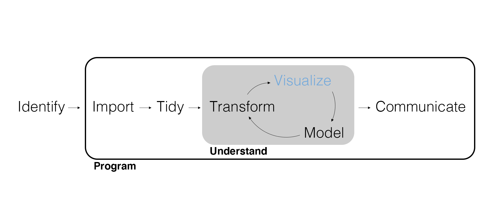
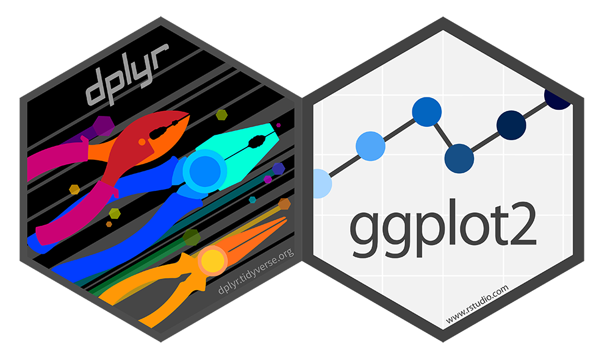
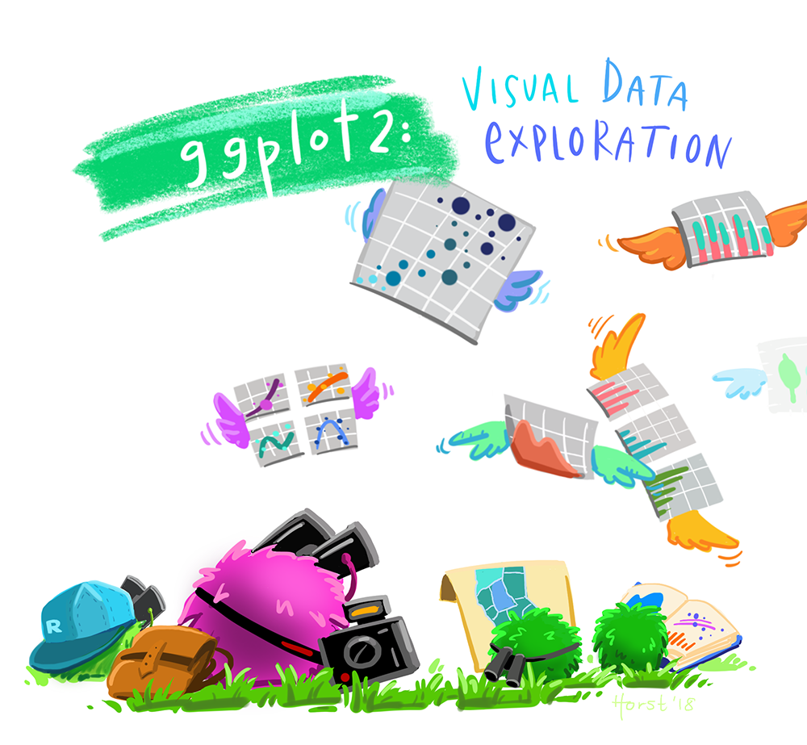
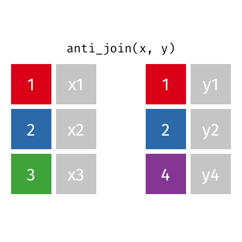

## Spiritual Thought

"Revelations are conveyed in a variety of ways...

A light turned on in a dark room is like receiving a message from God quickly, completely, and all at once...However, this pattern of revelation tends to be more rare than common.

The gradual increase of light radiating from the rising sun is like receiving a message from God 'line upon line, precept upon precept' (2 Nephi 28:30)."

[David A. Bednar, "Patterns of Revelation", April 2011](https://www.churchofjesuschrist.org/study/general-conference/2011/04/the-spirit-of-revelation?lang=eng).

## Consider the Example of Nephi: "A light in a dark room"

"And it came to pass that I, Nephi, being exceedingly young, nevertheless being large in stature, and also having great desires to know of the mysteries of God, wherefore, I did cry unto the Lord; and behold he did visit me, and did soften my heart that I did believe all the words which had been spoken by my father; wherefore, I did not rebel against him like unto my brothers."

1 Nephi 2:16.

## A Gradual Increase of Light

Nephi was asked to return to Jerusalem to get the brass plates.

- Returns to Jerusalem willingly
- Tries asking Laban for the plates (fails)
- Tries trading riches for the plates (fails)
- Tries again! 1 Nephi 4:6: "And I was led by the Spirit, not knowing beforehand the things which I should do." (success)

## 8 Years Later... Another "Light in a Dark Room"

Nephi is told by the Lord to go up to a mountain, where he is commanded to build a ship.

1 Nephi 17:9: "...Lord, whither shall I go that I may find ore to molten, that I may make tools to construct the ship after the manner which thou hast shown unto me?"

1 Nephi 18:1: Nephi was shown by the Lord "from time to time after what manner [he] should work the timbers of the ship."

## Be Patient with Yourself and the Lord

"In many of the uncertainties and challenges we encounter in our lives, God requires us to do our best, to act and not be acted upon (see 2 Nephi 2:26), and to trust in Him. We may not see angels, hear heavenly voices, or receive overwhelming spiritual impressions. We frequently may press forward hoping and praying—but without absolute assurance—that we are acting in accordance with God’s will. But as we honor our covenants and keep the commandments, as we strive ever more consistently to do good and to become better, we can walk with the confidence that God will guide our steps. And we can speak with the assurance that God will inspire our utterances. This is in part the meaning of the scripture that declares, 'Then shall thy confidence wax strong in the presence of God' (D&C 121:45)."

[David A. Bednar, "Patterns of Revelation", April 2011](https://www.churchofjesuschrist.org/study/general-conference/2011/04/the-spirit-of-revelation?lang=eng).

## Today's Learning Goals

- Summarize categorical customer characteristics with counts and cross-tabs.
- Compare customer groups using bar charts, proportions, and facets.
- Improve chart labels, colors, and category order.
- Turn review text into tokens and visualize frequent informative words.

## Grading Exercises

Remember that you grade your own submitted exercises using the rubric specified in each posted exercise solution, adding comments (using the comment feature for Word documents) where your solution differs from the posted solution.

## Marketing Analytics Process

<div style="display: flex; align-items: center; gap: 20px;">


</div>

## What Can You Learn from These Rows?

**Across all customers, is the share with a college degree similar across regions?**

```{r motivation-rows, echo=FALSE, message=FALSE, results='asis'}
local({
  customers <- readr::read_csv("customer_data.csv", show_col_types = FALSE)
  preview <- utils::head(
    customers[c("customer_id", "region", "married", "college_degree")],
    6
  )
  knitr::kable(
    preview,
    col.names = c("Customer", "Region", "Married", "College degree"),
    row.names = FALSE
  )
})
```

How easily could you answer the question by scanning thousands of rows?

## A Visualization Reveals the Regional Pattern

```{r motivation-chart, echo=FALSE, message=FALSE, fig.width=9, fig.height=3.6}
local({
  customers <- readr::read_csv("customer_data.csv", show_col_types = FALSE)
  degree_shares <- customers |>
    dplyr::count(region, college_degree) |>
    dplyr::group_by(region) |>
    dplyr::mutate(share = n / sum(n)) |>
    dplyr::ungroup() |>
    dplyr::filter(college_degree == "Yes")

  ggplot2::ggplot(degree_shares, ggplot2::aes(x = region, y = share)) +
    ggplot2::geom_col(fill = "cornflowerblue", width = 0.65) +
    ggplot2::geom_text(
      ggplot2::aes(label = sprintf("%.1f%%", 100 * share)),
      vjust = -0.5,
      size = 5
    ) +
    ggplot2::scale_y_continuous(
      labels = scales::label_percent(),
      limits = c(0, 1),
      breaks = seq(0, 1, 0.25)
    ) +
    ggplot2::labs(
      title = "Customers with a College Degree, by Region",
      subtitle = "All 10,531 customers; percentages calculated within each region",
      x = NULL,
      y = "Share of customers"
    ) +
    ggplot2::theme_minimal(base_size = 16)
})
```

About **20% in the South** have college degrees, compared with **79-81% elsewhere**. One chart summarizes the pattern across thousands of records.

## Discrete Data

Visualizations are a form of **summarizing data**. Summarizing data is initially all about discovery, the heart of **exploratory data analysis**.

- Computing **statistics** (i.e., numerical summaries).
- **Visualizing** data (i.e., graphical summaries).

How we summarize depends on whether the data is **discrete** or **continuous**.

- Discrete values are separate and distinct; numeric counts are discrete too.
- This lecture focuses on **categorical variables**, whose values identify groups.

---

```{r}
library(tidyverse)
```

---

Can you identify any *discrete* variables? What are their data types in R?

```{r}
customer_data <- read_csv("customer_data.csv", show_col_types = FALSE)
glimpse(customer_data)
```

## A Word About Data Types

Data **types** in R — as in all programming languages — are more than simple labels. They serve as essential instructions that tell the computer how to interpret and manipulate the values we provide. Some common ones include:

| **Data Type**       | **Abbreviation** | **Description**                               |
|---------------------|------------------|-----------------------------------------------|
| `logical`           | `lgl`            | Boolean values: `TRUE`, `FALSE`, or `NA`      |
| `integer`           | `int`            | Whole numbers (e.g. `1`, `42`)             |
| `double` (numeric)  | `dbl`            | Decimal numbers (e.g. `3.14`, `2.0`)         |
| `character`         | `chr`            | Text strings (e.g. `"hello"`, `"R"`)         |
| `factor`            | `fct`            | Categorical data with fixed levels (e.g. `"Low"`, `"High"`)            |


## Summarize Discrete Data

An important statistic for a discrete variable is a **count**.

```{r}
customer_data |> 
  count(region)
```

---

How would I get a count by both `region` and `college_degree` (i.e., a **cross-tab**)?

<div class="build">
<div>

```{r}
customer_data |> 
  count(region, college_degree)
```

</div>
</div>

## Your Turn!

Write code that first filters the data to only unmarried customers, then counts the customers in each region (you will need to use code we learned in the last lecture to do this!)

**Expected output:**

```{r, echo=FALSE}

customer_data |>
  filter(married == 'No') |>
  count(region)

```

## Here's The Solution

```{r eval=FALSE}

customer_data |>
  filter(married == 'No') |>
  count(region)

```

## Visualize Data

{ggplot2} provides a consistent **grammar of graphics** built with **layers**.

1. Data – Data to visualize.
2. Aesthetics – Or "aes," mapping graphical elements to data.
3. Geometry – Or "geom," the kind of graph representing the data.
4. Facets, Labels, Scales, etc.

---

<center>
{width=600px}
</center>

## Visualize Discrete Data

Let's plot our first summary (note how `+` is different from `|>`).

```{r eval=FALSE}
customer_data |> 
  count(region) |> 
  ggplot(aes(x = region, y = n)) +
  geom_col()
```

---

```{r echo=FALSE}
customer_data |> 
  count(region) |> 
  ggplot(aes(x = region, y = n)) +
  geom_col()
```

---

The aesthetic `fill = college_degree` colors the categories. By default, `geom_col()` stacks their counts.

```{r fig.width=8, fig.height=2.8}
customer_data |> 
  count(region, college_degree) |> 
  ggplot(aes(x = region, y = n, fill = college_degree)) +
  geom_col()
```

---

Set `position = "fill"` in `geom_col()` to show proportions: each region's full bar represents 100% of its customers.

```{r fig.width=8, fig.height=2.8}
customer_data |> 
  count(region, college_degree) |> 
  ggplot(aes(x = region, y = n, fill = college_degree)) +
  geom_col(position = "fill")
```

## Facets

Facets allow us to visualize by another discrete variable. For example, we can examine whether the relationship between `college_degree` and `region` is different depending on `gender`.

```{r eval=FALSE}
customer_data |> 
  count(region, college_degree, gender) |> 
  ggplot(aes(x = region, y = n, fill = college_degree)) +
  geom_col(position = "fill") +
  facet_wrap(~ gender)
```

---

```{r echo=FALSE}
customer_data |> 
  count(region, college_degree, gender) |> 
  ggplot(aes(x = region, y = n, fill = college_degree)) +
  geom_col(position = "fill") +
  facet_wrap(~ gender)
```

## Your Turn! | Audience Size or Concentration?

Patagonia is considering a campaign for customers without college degrees. Management wants to understand how this audience differs across regions and marital-status groups. They only have the funding to run the campaign in one region, so they have asked you to select the region where the campaign is likely to be most effective.

Create a faceted bar chart showing the **proportions of college-degree categories within each region**, with separate panels for marital status. Each full bar should represent 100% of the customers in that region and panel.

Which region has the greatest concentration of customers without degrees?

## Here's What Your Output Should Be

Panels show `married = No` and `married = Yes`. Each bar has its own region-and-marital-status denominator.

```{r echo=FALSE, fig.width=9, fig.height=3.5}
customer_data |>
  count(region, college_degree, married) |>
  ggplot(aes(x = region, y = n, fill = college_degree)) +
  geom_col(position = "fill") +
  facet_wrap(~ married) +
  labs(y = "Proportion")
```

## Here's The Solution | Faceted Proportions

```{r eval=FALSE}
customer_data |>
  count(region, college_degree, married) |>
  ggplot(aes(x = region, y = n, fill = college_degree)) +
  geom_col(position = "fill") +
  facet_wrap(~ married) +
  labs(y = "Proportion")
```

The South has the largest **share** without degrees in both panels. The `labs()` line names the vertical axis; we'll explore labels next.

## What Changes When We Use Counts?

```{r echo=FALSE, fig.width=9, fig.height=3.2}
customer_data |>
  count(region, college_degree, married) |>
  ggplot(aes(x = region, y = n, fill = college_degree)) +
  geom_col() +
  facet_wrap(~ married) +
  labs(y = "Customer Count")
```

The West has the largest **number** without degrees in both panels; the South has the largest **share**. Counts describe audience size; proportions describe concentration. Which matters for the campaign decision?

## Labels and Scales

Our proportion plots show shares rather than counts on the y-axis. Let's improve the labels on our earlier region-and-gender plot.

```{r eval=FALSE}
customer_data |> 
  count(region, college_degree, gender) |> 
  ggplot(aes(x = region, y = n, fill = college_degree)) +
  geom_col(position = "fill") +
  facet_wrap(~ gender) +
  labs(
    title = "Proportion of Customers with College Degrees by Region and Gender",
    subtitle = "Based on 10,531 Customers in the CRM Database",
    x = "Region",
    y = "Proportion"
  )
```

---

```{r echo=FALSE}
customer_data |> 
  count(region, college_degree, gender) |> 
  ggplot(aes(x = region, y = n, fill = college_degree)) +
  geom_col(position = "fill") +
  facet_wrap(~ gender) +
  labs(
    title = "Proportion of Customers with College Degrees by Region and Gender",
    subtitle = "Based on 10,531 Customers in the CRM Database",
    x = "Region",
    y = "Proportion"
  )
```

---

What about the legend? And these *colors*?

Append this scale to the preceding plot with `+`. The complete pipeline is in your starter code.

```{r eval=FALSE}
scale_fill_manual(
  name = "College Degree",
  values = c("cornflowerblue", "navy")
)
```

## What Else Should We Change? Are All Plot Aspects Legible?

```{r echo=FALSE}
customer_data |> 
  count(region, college_degree, gender) |> 
  ggplot(aes(x = region, y = n, fill = college_degree)) +
  geom_col(position = "fill") +
  facet_wrap(~ gender) +
  labs(
    title = "Proportion of Customers with College Degrees by Region and Gender",
    subtitle = "Based on 10,531 Customers in the CRM Database",
    x = "Region",
    y = "Proportion"
  ) +
  scale_fill_manual(
    name = "College Degree",
    values = c("cornflowerblue", "navy")
  )
```

## Let's Rotate the X-axis Labels

Append this theme adjustment to the labeled, recolored plot with `+`.

```{r eval=FALSE}
theme(axis.text.x = element_text(angle = 45, vjust=0.5))
```

---

```{r, echo=FALSE}
customer_data |> 
  count(region, college_degree, gender) |> 
  ggplot(aes(x = region, y = n, fill = college_degree)) +
  geom_col(position = "fill") +
  facet_wrap(~ gender) +
  labs(
    title = "Proportion of Customers with College Degrees by Region and Gender",
    subtitle = "Based on 10,531 Customers in the CRM Database",
    x = "Region",
    y = "Proportion"
  ) +
  scale_fill_manual(
    name = "College Degree",
    values = c("cornflowerblue", "navy")
  ) +
  theme(axis.text.x = element_text(angle = 45, vjust=0.5))
```

## Your Turn!

Look at the ggplot below (also found in your starter code). Figure out what summary it is displaying, and then add polished labels and colors to create a publication-ready graph.

```{r eval=FALSE}
customer_data |> 
  filter(region == "Northeast") |>
  count(state, married) |> 
  ggplot(aes(x = state, y = n, fill = married)) +
  geom_col(position = "fill")
```

## Possible Solution

```{r eval=FALSE}

customer_data |> 
  filter(region == "Northeast") |>
  count(state, married) |> 
  ggplot(aes(x = state, y = n, fill = married)) +
  geom_col(position = "fill") +
  labs(
    title = "Proportion of Married Customers in Each Northeast State",
    subtitle = "Based on 3,224 Customers in the CRM Database",
    x = "State",
    y = "Proportion"
  ) +
  scale_fill_manual(
    name = "Marital Status",
    values = c("#B2AC88", "#4b5320")
  )

```

---

```{r echo=FALSE}

customer_data |> 
  filter(region == "Northeast") |>
  count(state, married) |> 
  ggplot(aes(x = state, y = n, fill = married)) +
  geom_col(position = "fill") +
  labs(
    title = "Proportion of Married Customers in Each Northeast State",
    subtitle = "Based on 3,224 Customers in the CRM Database",
    x = "State",
    y = "Proportion"
  ) +
  scale_fill_manual(
    name = "Marital Status",
    values = c("#B2AC88", "#4b5320")
  )

```

## Text Data

Free-form text is **unstructured**.

What types of visualizations have you seen that are based on text data?

What sort of structure might we impose on text data so we can visualize it?

## Tokenize Text Data

We can use `unnest_tokens()` to **tokenize** the text (i.e., split it into individual words or tokens).

```{r}

library(tidytext)

review_data <- customer_data |>
  select(customer_id, review_text) |> 
  unnest_tokens(word, review_text)

review_data
```

## Summarize Text Data

With the text data tokenized, we can compute counts just like other discrete data.

```{r}
review_data |> 
  count(word) |> 
  arrange(desc(n))
```

## Drop Missing Data

**Missing values** are (and should be) encoded as `NA`.

```{r}
review_data <- review_data |> 
  drop_na(word)

review_data
```

## Remove Stop Words

Commonly used words aren’t very informative and are referred to as **stop words**.

```{r}
stop_words
```

## Remove Stop Words

An **anti join** returns rows that *don't* have matching IDs, keeping only the columns from the "left" data frame. (Think of it as the opposite of an inner join.)

```{r}
review_data <- review_data |>
  anti_join(stop_words, join_by(word))

review_data |> 
  count(word) |> 
  arrange(desc(n))
```

---

<center>
{width=500px}
</center>

## Visualize Word Counts

```{r eval=FALSE}
review_data |> 
  count(word) |> 
  arrange(desc(n)) |> 
  ggplot(aes(x = word, y = n)) +
  geom_col()
```

---

What can we do to make this plot readable?

```{r echo=FALSE}
review_data |>
  count(word) |>
  arrange(desc(n)) |>
  ggplot(aes(x = word, y = n)) +
  geom_col()
```

## Most Common Words -> Common Themes

```{r eval=FALSE}
review_data |> 
  count(word) |> 
  arrange(desc(n)) |> 
  slice(1:10) |>
  ggplot(aes(x = n, y = word)) +
  geom_col()
```

---

```{r echo=FALSE}
review_data |> 
  count(word) |> 
  arrange(desc(n)) |> 
  slice(1:10) |>
  ggplot(aes(x = n, y = word)) +
  geom_col()
```

Let's use factors to assign an **order** to the words.

## Factors | Choose the Category Order

Alphabetical order is not always the order we want.

```{r}
sizes <- c("small", "medium", "large")
sort(sizes)
```

## Factors | Set the Size Order

Specify the category sequence with a factor:

```{r}
sizes <- factor(sizes, levels = c("small", "medium", "large"))
sort(sizes)
```

Creating the factor sets its category order; it does not rearrange observations. Here, `sort()` uses that order to display the values.

## Factors | Order Students by Height

These three students are hypothetical. We want the names ordered by height, rather than alphabetically.

```{r}
students <- tibble(
  student = c("Alex", "Bailey", "Casey"),
  height_cm = c(178, 165, 190)
)
```

## Factors | Use Height to Order the Names

Use height to set the name categories from shortest to tallest.

```{r}
students <- students |>
  mutate(student = fct_reorder(student, height_cm))

levels(students$student)
```

`fct_reorder()` sets the order to **Bailey, Alex, Casey**, from shortest to tallest. The rows stay in their original order.

## The Chart Uses the Factor Order

```{r, fig.width=7, fig.height=3}
students |>
  ggplot(aes(x = student, y = height_cm)) +
  geom_col() +
  labs(x = "Student", y = "Height (cm)")
```

Now apply the same idea to words: order the word categories by their counts.

## Apply Factor Order to Word Counts

```{r eval=FALSE}
review_data |> 
  count(word) |> 
  arrange(desc(n)) |> 
  slice(1:10) |> 
  mutate(word = fct_reorder(word, n)) |>
  ggplot(aes(x = n, y = word)) +
  geom_col()
```

---

```{r echo=FALSE}
review_data |> 
  count(word) |> 
  arrange(desc(n)) |> 
  slice(1:10) |> 
  mutate(word = fct_reorder(word, n)) |>
  ggplot(aes(x = n, y = word)) +
  geom_col()
```

## Factors | What a Factor Stores

Unlike a character variable, a **factor** stores a defined sequence of categories.

- Integer codes represent categories internally; `levels` stores their names as character strings.
- The level sequence controls plotting order. `fct_reorder()` changes that sequence using another variable.

## Live Coding

Going back to our prompt from the beginning, imagine Patagonia management is interested in a breakdown of the type of customers, and their preferences, in the `South` region. What type of visualization could we do to accomplish this?

## Wrapping Up

*Summary*

- Computed counts, including tokenizing and counting text.
- Practiced the basics of plotting with {ggplot2}.

*Next Time*

- Summarizing continuous data with {dplyr}.
- Visualizing continuous data with {ggplot2}.

*Supplementary Material*

- *R for Data Science (2e)*: [1 Data visualization](https://r4ds.hadley.nz/data-visualize.html), [9 Layers](https://r4ds.hadley.nz/layers.html), and [16 Factors](https://r4ds.hadley.nz/factors.html).
- Optional background: [18 Missing values](https://r4ds.hadley.nz/missing-values.html).

*Artwork by @allison_horst*
